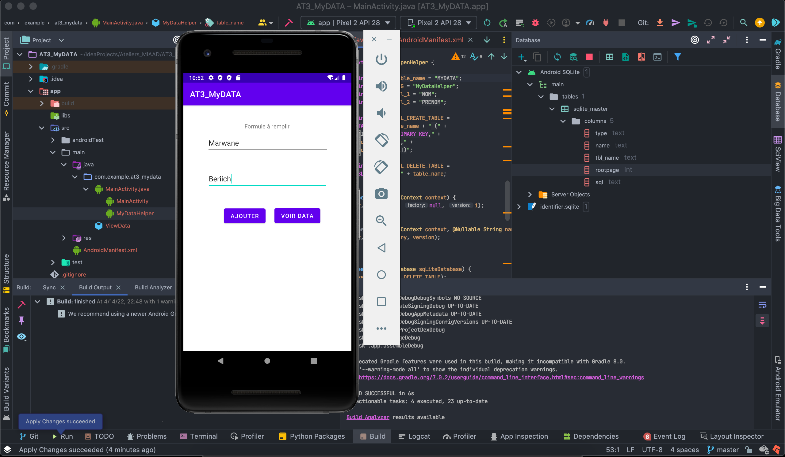
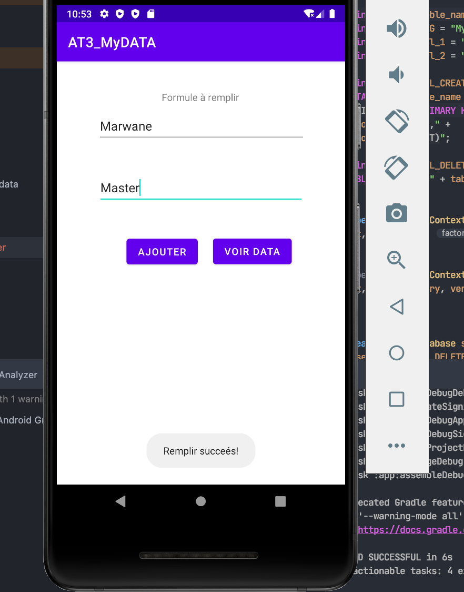
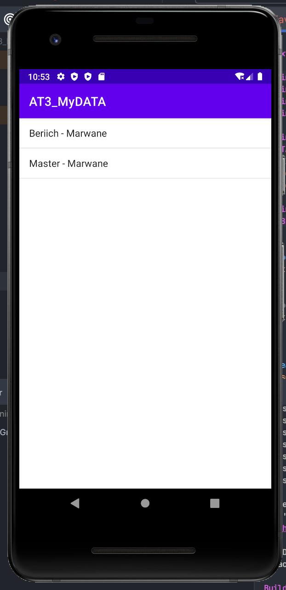

# MIAAD - Programmation d’interfaces embarquées

Encadré par : **Pr. S. BENHLIMA**  
Réaliser par : **Marwane BERIICH**  
Ce repository contient tous les TP de Module: Programmation d’interfaces embarquées  Pr. S. BENHLIMA

## 3éme TP

Ce TP nous permet d'entrer au premier fenétre un `nom` et `prenom`. Et aprés les enregistrer dans une base de données.

En peux récupere les donnés dans une deuxieme fenetre qui contient une `ListView`.

> Fenetre 1: etat initial d'application.

> Fenetre 2: alert lorsque utilisateur bien remplir les champs.

> Fenetre 3: afficher le text dans list view.

Au cas où vous auriez des questions, n'hésitez pas à me contacter à [mail](mailto:marwaneberiich@gmail.com)

